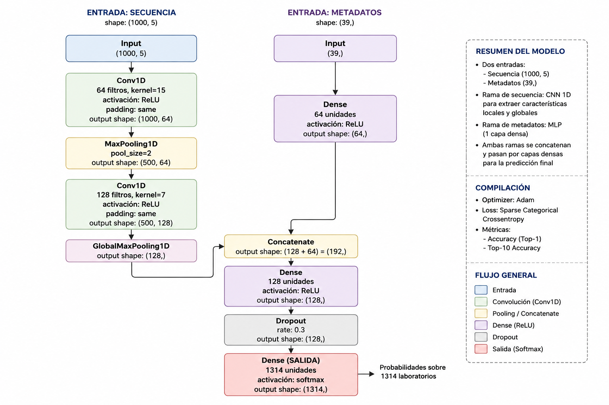

# Genetic Engineering Attribution mediante Machine Learning

## Descripción del proyecto

Este proyecto aborda el problema de **Genetic Engineering Attribution**, cuyo objetivo es identificar el laboratorio responsable del diseño de un plásmido a partir de su secuencia de ADN y de un conjunto de características biológicas asociadas.

Para su desarrollo se utilizaron los datos proporcionados por la competencia **Genetic Engineering Attribution** de DrivenData. El trabajo se planteó en dos etapas: inicialmente se implementó el modelo base recomendado por la competencia y, posteriormente, se desarrolló una solución basada en redes neuronales convolucionales con el fin de aprovechar directamente la información contenida en las secuencias de ADN.

---

## Conjunto de datos

Cada plásmido está compuesto por dos tipos de información:

* **Secuencia de ADN**, representada como una cadena de nucleótidos de longitud variable.
* **Características biológicas (metadatos)**, entre las que se incluyen:

  * Resistencia a antibióticos.
  * Número de copias.
  * Cepa de crecimiento.
  * Temperatura de crecimiento.
  * Marcadores de selección.
  * Especie objetivo.

La variable objetivo corresponde al laboratorio que diseñó el plásmido.

---

## Primera fase: Modelo base

Como punto de partida se siguieron las recomendaciones propuestas por la competencia, implementando un modelo de **Random Forest** como línea base (*baseline*).

Este enfoque permitió:

* Comprender la estructura del conjunto de datos.
* Familiarizarse con la metodología de evaluación utilizada en la competencia.
* Obtener un punto de referencia para comparar otro modelo más complejo.

---

## Segunda fase: Red neuronal convolucional

Tras implementar el modelo base, se identificó que gran parte de la información relevante se encontraba en las propias secuencias de ADN.

Los modelos tradicionales, como Random Forest, requieren representar las secuencias mediante características previamente definidas, mientras que una red neuronal convolucional (CNN) es capaz de aprender automáticamente patrones presentes en la secuencia, como motivos biológicos o combinaciones locales de nucleótidos.

Por esta razón se diseñó una arquitectura de aprendizaje profundo capaz de procesar simultáneamente:

* La secuencia de ADN.
* Los metadatos biológicos asociados al plásmido.

---

## Preprocesamiento de los datos

### División del conjunto de datos

Antes de generar las muestras utilizadas para el entrenamiento, el conjunto original se dividió en datos de entrenamiento y validación.

Esta decisión evita la fuga de información (*data leakage*), ya que todas las ventanas generadas a partir de un mismo plásmido permanecen dentro del mismo conjunto.

---

### Generación de ventanas

Las secuencias presentan longitudes muy variables.

En lugar de eliminar información recortando las secuencias largas o rellenarlas hasta la longitud máxima, se decidió dividir cada secuencia en múltiples ventanas de longitud fija.

Esta estrategia permite:

* Conservar información de secuencias largas.
* Trabajar con entradas de tamaño uniforme.
* Incrementar el número de ejemplos disponibles para entrenamiento.
* Facilitar que la CNN aprenda patrones locales de la secuencia.

Las características biológicas y la etiqueta del laboratorio fueron replicadas para cada ventana generada, ya que todas ellas pertenecen al mismo plásmido.

---

### Codificación de las secuencias

Cada nucleótido fue representado mediante **One-Hot Encoding**.

| Nucleótido | Representación |
| ---------- | -------------- |
| A          | [1,0,0,0,0]    |
| C          | [0,1,0,0,0]    |
| G          | [0,0,1,0,0]    |
| T          | [0,0,0,1,0]    |
| N          | [0,0,0,0,1]    |

Se decidió mantener el nucleótido **N** como una categoría independiente debido a que aparece tanto en las secuencias originales como durante el proceso de padding. Esto permite que el modelo distinga entre una base conocida y una posición desconocida o rellenada.

---

### Codificación de las etiquetas

Los identificadores de los laboratorios fueron transformados a valores enteros mediante `LabelEncoder`, permitiendo utilizar la función de pérdida **Sparse Categorical Crossentropy** de TensorFlow.

---

## Arquitectura del modelo

Se implementó una arquitectura de doble entrada utilizando la API funcional de TensorFlow/Keras.

### Rama de secuencias

La secuencia de ADN es procesada mediante una red convolucional compuesta por:

* Conv1D (64 filtros)
* MaxPooling1D
* Conv1D (128 filtros)
* GlobalMaxPooling1D

Esta rama aprende automáticamente patrones locales presentes en las secuencias.

### Rama de metadatos

Los metadatos son procesados mediante una capa completamente conectada (*Dense*), obteniendo una representación compacta de las características biológicas.

### Fusión de información

Las representaciones obtenidas por ambas ramas se concatenan y posteriormente son procesadas por capas densas antes de realizar la clasificación final.

La capa de salida utiliza una función de activación **Softmax**, con una neurona por cada laboratorio presente en el conjunto de datos.

---

## Entrenamiento

El modelo fue desarrollado utilizando TensorFlow/Keras.

Durante el entrenamiento se utilizaron:

* Optimizador **Adam**.
* Función de pérdida **Sparse Categorical Crossentropy**.
* Métrica de **Accuracy**.
* Métrica **Top-10 Accuracy**.

La métrica Top-10 Accuracy fue seleccionada porque corresponde al criterio oficial de evaluación de la competencia, donde una predicción se considera correcta si el laboratorio verdadero aparece entre las diez predicciones con mayor probabilidad.

---

## Justificación de las decisiones tomadas

Las principales decisiones metodológicas del proyecto fueron:

* Implementar inicialmente el modelo recomendado por la competencia para disponer de una línea base de comparación.
* Dividir el conjunto de datos antes de generar las ventanas, evitando la fuga de información entre entrenamiento y validación.
* Utilizar ventanas de longitud fija para preservar la mayor cantidad posible de información de las secuencias largas.
* Representar las secuencias mediante One-Hot Encoding por tratarse de una representación sencilla, interpretable y ampliamente utilizada en problemas de bioinformática.
* Procesar de forma independiente las secuencias y los metadatos mediante una arquitectura de doble entrada, permitiendo que cada tipo de información sea tratado de acuerdo con su naturaleza.
* Utilizar `tf.data.Dataset` para construir un flujo de datos eficiente, evitando almacenar en memoria todas las secuencias codificadas.

---

## Trabajo futuro

Como posibles mejoras del proyecto se plantean:

* Ajuste de hiperparámetros.
* Evaluación de arquitecturas convolucionales más profundas.
* Implementación de modelos basados en Transformers para secuencias biológicas.
* Incorporación de técnicas de aumento de datos.
* Ensambles entre modelos clásicos y redes neuronales.
* Métodos de interpretabilidad para identificar regiones de la secuencia con mayor influencia en la clasificación.

---

## Referencias

* Competencia **Genetic Engineering Attribution** de DrivenData.
* Documentación oficial de TensorFlow/Keras.
* Documentación oficial de Scikit-learn.
